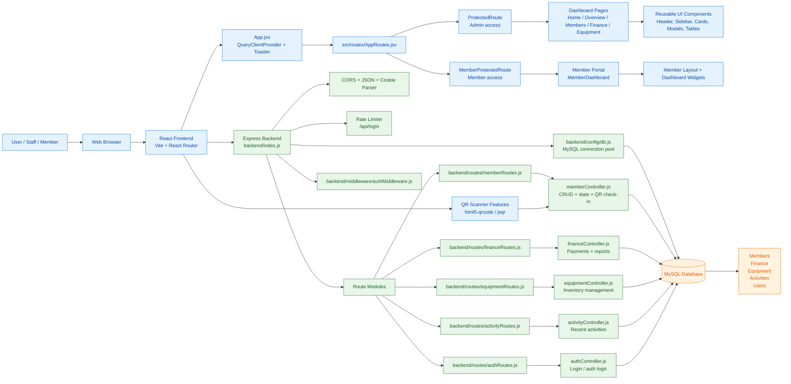

# GAMS Project Architecture Diagram

## Project Summary

This project is a full-stack gym management system built with:

- Frontend: React + Vite + React Router
- Backend: Express.js API server
- Database: MySQL via mysql2 pool connection
- Features: member management, finance tracking, equipment management, activity logs, authentication, and QR check-in

## Main Entry Points

- Frontend app: `src/App.jsx`
- Router: `src/routes/AppRoutes.jsx`
- Backend server: `backend/index.js`
- Database config: `backend/config/db.js`
- API routes: `backend/routes/`
- Controllers: `backend/controllers/`
